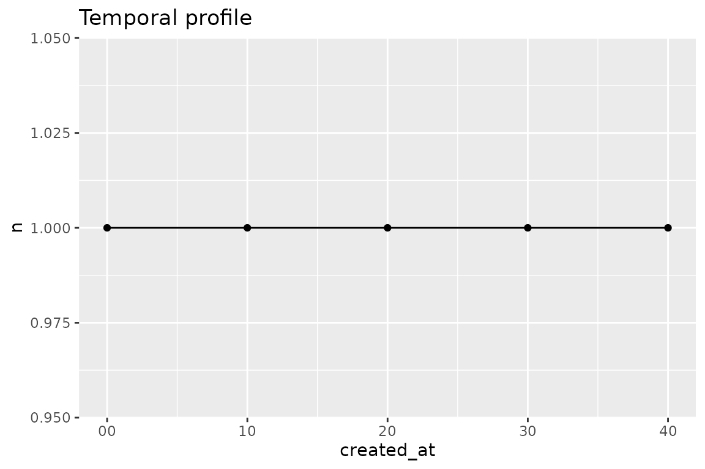

# A complete reproducible analysis

This vignette walks one end-to-end analysis: snapshot the database,
build a provenance-stamped dataset, profile it, and export — everything
documented so the result can be reproduced later.

## 1. Snapshot, then connect

The database may be live under EntropIA. Before analysis, take a
snapshot with
[`entropia_copy()`](https://humalab.github.io/EntropIA-R/reference/entropia_copy.md)
and run against *that*, so the analysis is immune to writes landing
mid-run and the provenance records a stable source.

``` r

con <- entropia_connect(system.file("extdata", "entropia-example.sqlite", package = "entropiaR"))
snap <- tempfile(fileext = ".sqlite")
entropia_copy(con, snap)
snap_con <- entropia_connect(snap)
entropia_disconnect(con) # original connection no longer needed
```

## 2. Build the analysis dataset

[`entropia_analysis_dataset()`](https://humalab.github.io/EntropIA-R/reference/entropia_analysis_dataset.md)
applies filters to the corpus, collects it, and stamps provenance. This
is the boundary: everything after it is ordinary tibble work, and
everything before it is recorded.

``` r

corpus <- entropia_analysis_dataset(snap_con, name = "corpus_full")
corpus
#> entropia_dataset: corpus_full
#>   schema: 0029_rag_chunks  content: 09d4c603b66d
#> # A tibble: 5 × 19
#>   item_id      item_title collection_id metadata item_created_at item_updated_at
#>   <chr>        <chr>      <chr>         <chr>            <int64>         <int64>
#> 1 22222222-22… Manifiest… 11111111-111… "{\"__e…   1768478460000   1768478520000
#> 2 22222222-22… Manifiest… 11111111-111… "{\"__e…   1768478460000   1768478520000
#> 3 22222222-22… Manifiest… 11111111-111… "{\"__e…   1768478460000   1768478520000
#> 4 22222222-22… Fotografí… 11111111-111…  NA        1768478700000   1768478760000
#> 5 22222222-22… Carta al … 11111111-111… "{\"__e…   1768478580000   1768478640000
#> # ℹ 13 more variables: collection_name <chr>, collection_description <chr>,
#> #   collection_created_at <int64>, collection_updated_at <int64>,
#> #   asset_id <chr>, asset_path <chr>, asset_type <chr>, asset_size <int>,
#> #   asset_created_at <int64>, asset_sort_index <int>, parent_asset_id <chr>,
#> #   page_number <int>, text <chr>
```

``` r

entropia_provenance(corpus)
#> entropiaR dataset provenance
#>   name:           corpus_full
#>   schema version: 0029_rag_chunks
#>   content hash:   09d4c603b66d68c4c0cef0f51ff09a04fb30a49fe200907ef69693d11dd25732
#>   source path:    /tmp/RtmpG2NdhL/file1edd58424b23.sqlite
#>   package:        0.0.0.9000
#>   built at:       2026-08-24T01:10:27.977Z
#>   R version:      R version 4.6.1 (2026-06-24)
```

## 3. Temporal profile

When were assets created?
[`entropia_temporal_profile()`](https://humalab.github.io/EntropIA-R/reference/entropia_temporal_profile.md)
buckets a date column. Collect the asset accessor directly —
[`entropia_collect()`](https://humalab.github.io/EntropIA-R/reference/entropia_collect.md)
types its millisecond timestamps to `POSIXct`, which the profiler
requires:

``` r

assets <- entropia_assets(snap_con) |> entropia_collect()
temporal <- entropia_temporal_profile(assets, created_at, unit = "second")
temporal
#> # A tibble: 5 × 2
#>   created_at              n
#>   <dttm>              <int>
#> 1 2026-01-15 12:07:00     1
#> 2 2026-01-15 12:07:10     1
#> 3 2026-01-15 12:07:20     1
#> 4 2026-01-15 12:07:30     1
#> 5 2026-01-15 12:07:40     1
```

## 4. Document lengths

[`entropia_document_lengths()`](https://humalab.github.io/EntropIA-R/reference/entropia_document_lengths.md)
appends character and word counts per document to any tibble carrying a
text column:

``` r

texts <- entropia_text(snap_con) |> entropia_collect()
lengths <- entropia_document_lengths(texts)
lengths |> select(id, n_chars, n_words)
#> # A tibble: 5 × 3
#>   id                                   n_chars n_words
#>   <chr>                                  <int>   <int>
#> 1 33333333-3333-4333-8333-333333333331      50       9
#> 2 33333333-3333-4333-8333-333333333332      54       7
#> 3 33333333-3333-4333-8333-333333333333      NA      NA
#> 4 33333333-3333-4333-8333-333333333334      NA      NA
#> 5 33333333-3333-4333-8333-333333333335      23       4
```

Empty text counts as 0; `NA` text stays `NA`.

## 5. Entities

[`entropia_entities()`](https://humalab.github.io/EntropIA-R/reference/entropia_entities.md)
excludes soft-deleted rows by default and surfaces provenance (source
model) per entity.
[`entropia_entity_frequency()`](https://humalab.github.io/EntropIA-R/reference/entropia_entity_frequency.md)
tallies them by type:

``` r

entities <- entropia_entities(snap_con) |> entropia_collect()
entropia_entity_frequency(entities)
#> # A tibble: 3 × 3
#>   entity_type  value                     n
#>   <chr>        <chr>                 <int>
#> 1 organization Sindicato Ferroviario     1
#> 2 person       Juan Pérez                1
#> 3 place        Plaza de Mayo             1
```

## 6. Topics

Topics are normalized UPPERCASE names. Join `item_topics` to `topics`,
then tally:

``` r

item_topics <- entropia_item_topics(snap_con) |> entropia_collect()
topics <- entropia_topics(snap_con) |> entropia_collect()
entropia_topic_frequency(left_join(item_topics, topics, by = c("topic_id" = "id")))
#> # A tibble: 2 × 2
#>   name          n
#>   <chr>     <int>
#> 1 HUELGA        1
#> 2 SINDICATO     1
```

## 7. Collections side by side

[`entropia_compare_collections()`](https://humalab.github.io/EntropIA-R/reference/entropia_compare_collections.md)
summarizes the corpus per collection:

``` r

entropia_compare_collections(corpus)
#> # A tibble: 1 × 4
#>   collection_name   n_items n_assets     n
#>   <chr>               <int>    <int> <int>
#> 1 Archivo de prueba       3        5     5
```

## 8. Corpus quality

[`entropia_corpus_quality()`](https://humalab.github.io/EntropIA-R/reference/entropia_corpus_quality.md)
reports OCR coverage, transcription presence, and empty texts per asset
type, plus metadata coverage per collection:

``` r

quality <- entropia_corpus_quality(snap_con)
quality
#> # A tibble: 10 × 5
#>    metric                 group                 n total    pct
#>    <chr>                  <chr>             <int> <int>  <dbl>
#>  1 empty_text             audio                 0     1  0    
#>  2 empty_text             image                 0     0 NA    
#>  3 empty_text             pdf                   0     2  0    
#>  4 metadata_coverage      Archivo de prueba     2     3  0.667
#>  5 ocr_coverage           audio                 0     1  0    
#>  6 ocr_coverage           image                 0     1  0    
#>  7 ocr_coverage           pdf                   2     3  0.667
#>  8 transcription_presence audio                 1     1  1    
#>  9 transcription_presence image                 0     1  0    
#> 10 transcription_presence pdf                   0     3  0
```

## 9. Visualize

`entropia_plot_*` helpers wrap the analysis summaries in ggplot2
(Suggests) and return ordinary `ggplot` objects you can extend:

``` r

entropia_plot_temporal(temporal)
```



``` r

entropia_plot_entities(entropia_entity_frequency(entities))
```


``` r

entropia_plot_coverage(quality)
#> Warning: Removed 1 row containing missing values or values outside the scale range
#> (`geom_col()`).
```


## 10. Export with provenance

The dataset exports as-is (RDS keeps its class and provenance; CSV is
streamed for lazy inputs). Always write the provenance sidecar
alongside:

``` r

export_path <- tempfile(fileext = ".csv")
entropia_export(entropia_corpus(snap_con), export_path)

rds_path <- tempfile(fileext = ".rds")
entropia_export(corpus, rds_path, format = "rds")
prov_path <- tempfile(fileext = "-prov.json")
entropia_write_provenance(corpus, prov_path)
```

The RDS round-trips with its provenance intact:

``` r

back <- readRDS(rds_path)
entropia_provenance(back)[["name"]]
#> [1] "corpus_full"
```

## Cleanup

``` r

entropia_disconnect(snap_con)
```

That is the loop: snapshot → build a stamped dataset → analyze → export
with a sidecar. Each step uses functions documented elsewhere in this
site; the provenance records the whole chain.
