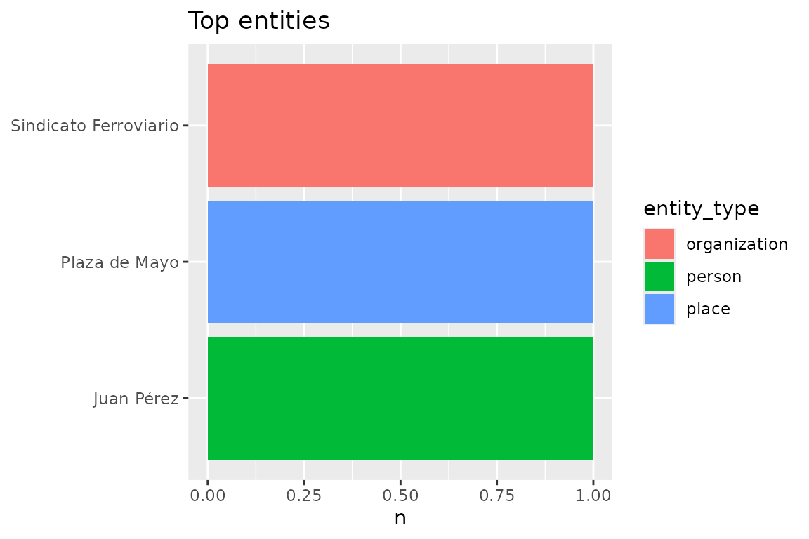
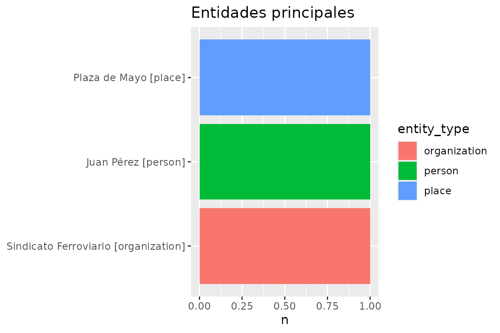
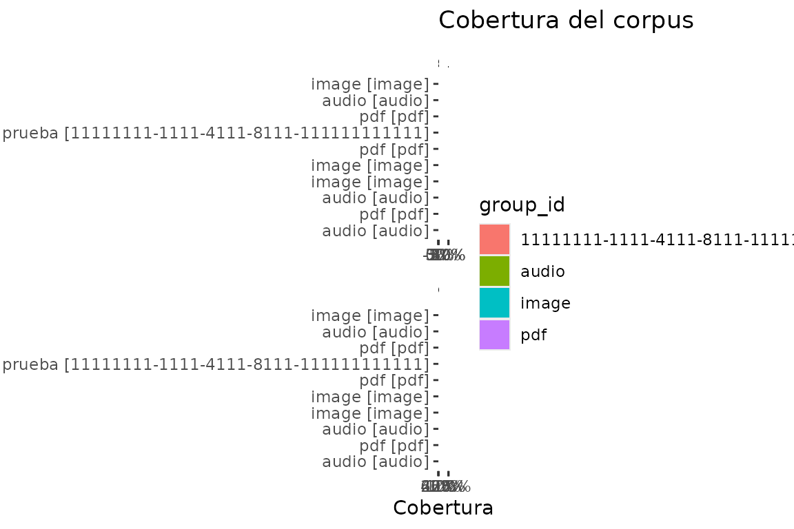
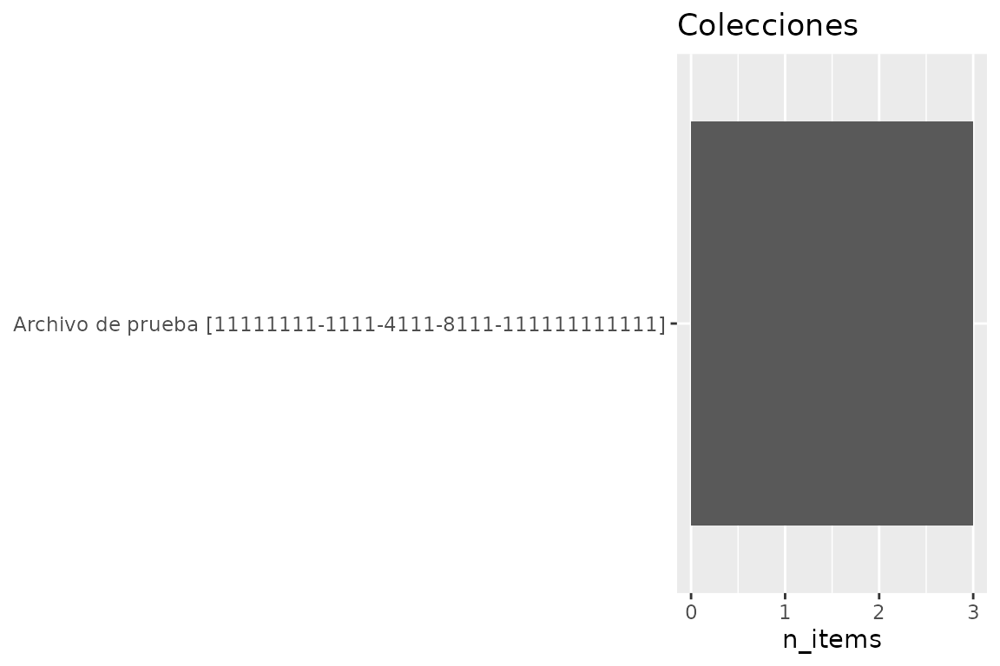

# Un análisis reproducible de punta a punta

*Versión en español.* English:
[`vignette("analysis.en")`](https://humalab.github.io/EntropIA-R/articles/analysis.en.md).

Recorrido: snapshot → overview → dataset con procedencia → perfiles →
gráficos → exportar.

## 1. Snapshot y conexión

Si EntropIA puede estar abierta, copiá primero con
[`entropia_copy()`](https://humalab.github.io/EntropIA-R/reference/entropia_copy.md)
y analizá *esa* copia.

``` r

con <- entropia_connect(system.file("extdata", "entropia-example.sqlite", package = "entropiaR"))
snap <- tempfile(fileext = ".sqlite")
entropia_copy(con, snap)
snap_con <- entropia_connect(snap)
entropia_disconnect(con)
```

## 2. Inventario del snapshot

[`entropia_overview()`](https://humalab.github.io/EntropIA-R/reference/entropia_overview.md)
es el primer paso barato: recuentos y calidad sin bajar OCR.

``` r

eda <- entropia_overview(snap_con)
eda$counts
#> # A tibble: 5 × 3
#>   metric               unit           n
#>   <chr>                <chr>      <int>
#> 1 items                item           3
#> 2 assets               asset          5
#> 3 collections          collection     1
#> 4 items_without_assets item           0
#> 5 pages                asset          2
eda$collections
#> # A tibble: 1 × 5
#>   collection_id                        collection_name   n_items n_assets     n
#>   <chr>                                <chr>               <int>    <int> <int>
#> 1 11111111-1111-4111-8111-111111111111 Archivo de prueba       3        5     5
```

## 3. Dataset de análisis

[`entropia_analysis_dataset()`](https://humalab.github.io/EntropIA-R/reference/entropia_analysis_dataset.md)
filtra el corpus, colecta y sella procedencia v2.

``` r

corpus <- entropia_analysis_dataset(snap_con, name = "corpus_full")
#> Warning: Missing values are always removed in SQL aggregation functions.
#> Use `na.rm = TRUE` to silence this warning
#> This warning is displayed once every 8 hours.
corpus
#> entropia_dataset: corpus_full
#>   schema: 0029_rag_chunks  hash: 09d4c603b66d
#> # A tibble: 5 × 19
#>   item_id              item_title collection_id metadata     item_created_at    
#>   <chr>                <chr>      <chr>         <list>       <dttm>             
#> 1 22222222-2222-4222-… Manifiest… 11111111-111… <named list> 2026-01-15 12:01:00
#> 2 22222222-2222-4222-… Manifiest… 11111111-111… <named list> 2026-01-15 12:01:00
#> 3 22222222-2222-4222-… Manifiest… 11111111-111… <named list> 2026-01-15 12:01:00
#> 4 22222222-2222-4222-… Carta al … 11111111-111… <named list> 2026-01-15 12:03:00
#> 5 22222222-2222-4222-… Fotografí… 11111111-111… <chr [1]>    2026-01-15 12:05:00
#> # ℹ 14 more variables: item_updated_at <dttm>, collection_name <chr>,
#> #   collection_description <chr>, collection_created_at <dttm>,
#> #   collection_updated_at <dttm>, asset_id <chr>, asset_path <chr>,
#> #   asset_type <chr>, asset_size <int>, asset_created_at <dttm>,
#> #   asset_sort_index <int>, parent_asset_id <chr>, page_number <int>,
#> #   text <chr>
```

``` r

entropia_provenance(corpus)
#> entropiaR dataset provenance
#>   name:           corpus_full
#>   schema version: 0029_rag_chunks
#>   schema hash:    09d4c603b66d68c4c0cef0f51ff09a04fb30a49fe200907ef69693d11dd25732
#>   dataset hash:   c7d9e919196ad9347a4ba5b7fdeff6a8bfe94e3703ee2f79d05624a7f93a40f0
#>   scope:          origin
#>   source path:    /tmp/Rtmpr3mjS3/file201a36b2095e.sqlite
#>   package:        0.0.0.9000
#>   built at:       2026-09-11T18:33:17.713Z
#>   R version:      R version 4.6.1 (2026-06-24)
```

## 4. Perfil temporal

Colectá el accesor:
[`entropia_collect()`](https://humalab.github.io/EntropIA-R/reference/entropia_collect.md)
tipa ms a `POSIXct`.

``` r

assets <- entropia_assets(snap_con) |> entropia_collect()
temporal <- entropia_temporal_profile(assets, created_at, unit = "second")
temporal
#> # A tibble: 5 × 2
#>   created_at              n
#>   <dttm>              <int>
#> 1 2026-01-15 12:07:00     1
#> 2 2026-01-15 12:07:10     1
#> 3 2026-01-15 12:07:20     1
#> 4 2026-01-15 12:07:30     1
#> 5 2026-01-15 12:07:40     1
```

## 5. Longitudes de documento

``` r

texts <- entropia_text(snap_con) |> entropia_collect()
lengths <- entropia_document_lengths(texts)
lengths |> select(id, n_chars, n_words)
#> # A tibble: 5 × 3
#>   id                                   n_chars n_words
#>   <chr>                                  <int>   <int>
#> 1 33333333-3333-4333-8333-333333333331      50       9
#> 2 33333333-3333-4333-8333-333333333332      54       7
#> 3 33333333-3333-4333-8333-333333333333      NA      NA
#> 4 33333333-3333-4333-8333-333333333334      NA      NA
#> 5 33333333-3333-4333-8333-333333333335      23       4
```

Texto vacío cuenta 0; `NA` sigue `NA`.

## 6. Entidades

Por defecto se ocultan filas `manual_deleted`.

``` r

entities <- entropia_entities(snap_con) |> entropia_collect()
entropia_entity_frequency(entities)
#> # A tibble: 3 × 3
#>   entity_type  value                     n
#>   <chr>        <chr>                 <int>
#> 1 organization Sindicato Ferroviario     1
#> 2 person       Juan Pérez                1
#> 3 place        Plaza de Mayo             1
```

## 7. Temas

Nombres normalizados a MAYÚSCULAS. Unir `item_topics` con `topics`:

``` r

item_topics <- entropia_item_topics(snap_con) |> entropia_collect()
topics <- entropia_topics(snap_con) |> entropia_collect()
entropia_topic_frequency(left_join(item_topics, topics, by = c("topic_id" = "id")))
#> # A tibble: 2 × 2
#>   name          n
#>   <chr>     <int>
#> 1 HUELGA        1
#> 2 SINDICATO     1
```

## 8. Colecciones lado a lado

Agrupa por `collection_id` cuando existe; el nombre es etiqueta.

``` r

entropia_compare_collections(corpus)
#> # A tibble: 1 × 5
#>   collection_id                        collection_name   n_items n_assets     n
#>   <chr>                                <chr>               <int>    <int> <int>
#> 1 11111111-1111-4111-8111-111111111111 Archivo de prueba       3        5     5
```

## 9. Calidad del corpus

``` r

quality <- entropia_corpus_quality(snap_con)
quality
#> # A tibble: 10 × 8
#>    metric                 group_id         group unit      n total    pct status
#>    <chr>                  <chr>            <chr> <chr> <int> <int>  <dbl> <chr> 
#>  1 empty_text             audio            audio asset     0     1  0     ok    
#>  2 empty_text             image            image asset     0     0 NA     no_da…
#>  3 empty_text             pdf              pdf   asset     0     2  0     ok    
#>  4 metadata_coverage      11111111-1111-4… Arch… item      2     3  0.667 ok    
#>  5 ocr_coverage           audio            audio asset     0     1  0     ok    
#>  6 ocr_coverage           image            image asset     0     1  0     ok    
#>  7 ocr_coverage           pdf              pdf   asset     2     3  0.667 ok    
#>  8 transcription_presence audio            audio asset     1     1  1     ok    
#>  9 transcription_presence image            image asset     0     1  0     ok    
#> 10 transcription_presence pdf              pdf   asset     0     3  0     ok
```

## 10. Visualizar

``` r

entropia_plot_temporal(temporal)
```



``` r

entropia_plot_entities(entropia_entity_frequency(entities))
```



``` r

entropia_plot_coverage(quality)
```



``` r

entropia_plot_collections(eda$collections)
```



## 11. Exportar con procedencia

RDS conserva clase y sello; CSV perezoso se streamea.

``` r

export_path <- tempfile(fileext = ".csv")
entropia_export(entropia_corpus(snap_con), export_path)

rds_path <- tempfile(fileext = ".rds")
entropia_export(corpus, rds_path, format = "rds")
prov_path <- tempfile(fileext = "-prov.json")
entropia_write_provenance(corpus, prov_path)
```

``` r

back <- readRDS(rds_path)
entropia_provenance(back)[["name"]]
#> [1] "corpus_full"
```

``` r

entropia_disconnect(snap_con)
```

Siguiente:
[`vignette("eda")`](https://humalab.github.io/EntropIA-R/articles/eda.md)
y
[`vignette("dashboard")`](https://humalab.github.io/EntropIA-R/articles/dashboard.md).
English:
[`vignette("analysis.en")`](https://humalab.github.io/EntropIA-R/articles/analysis.en.md).
