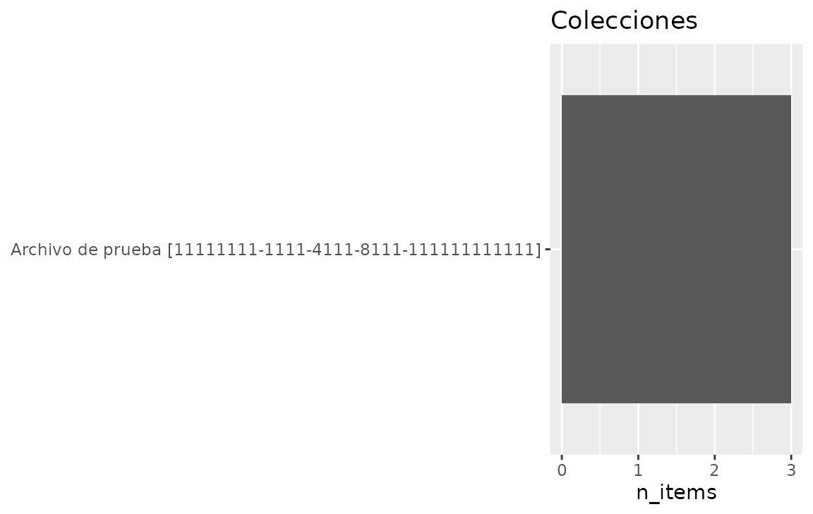
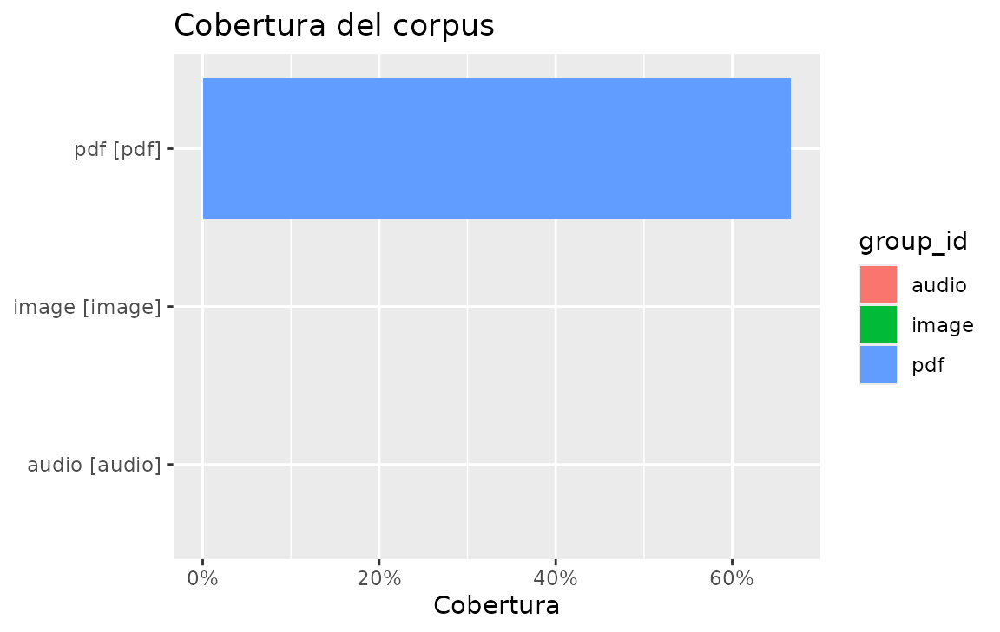
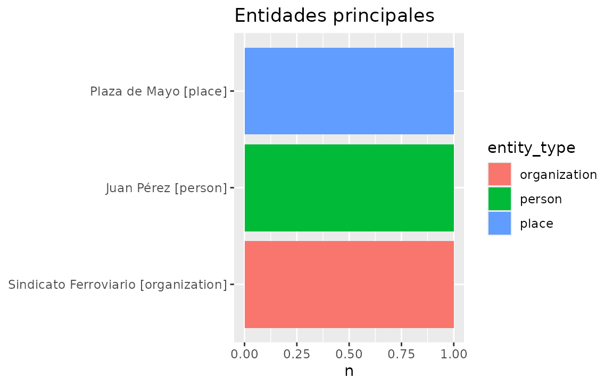
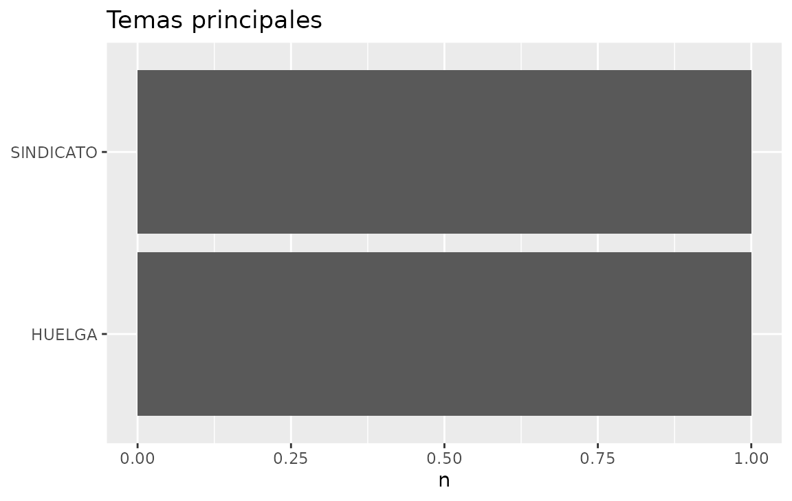
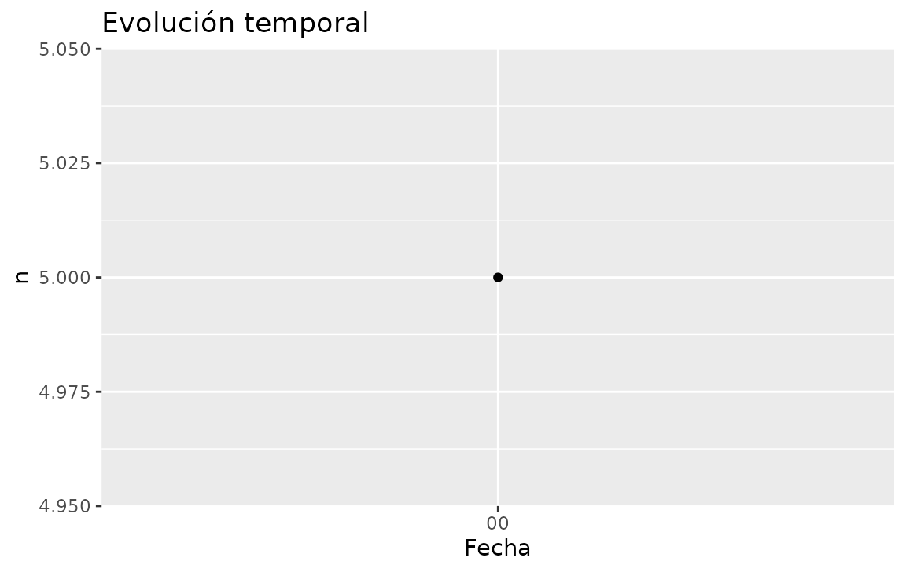
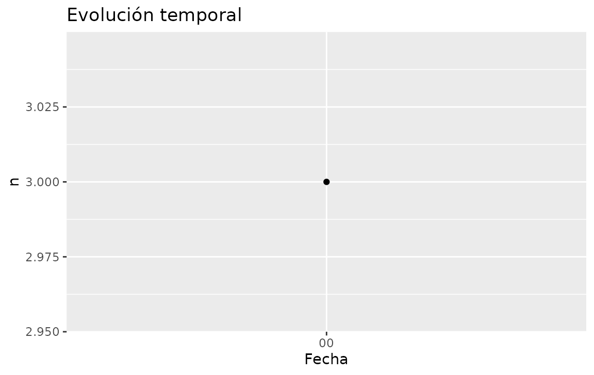
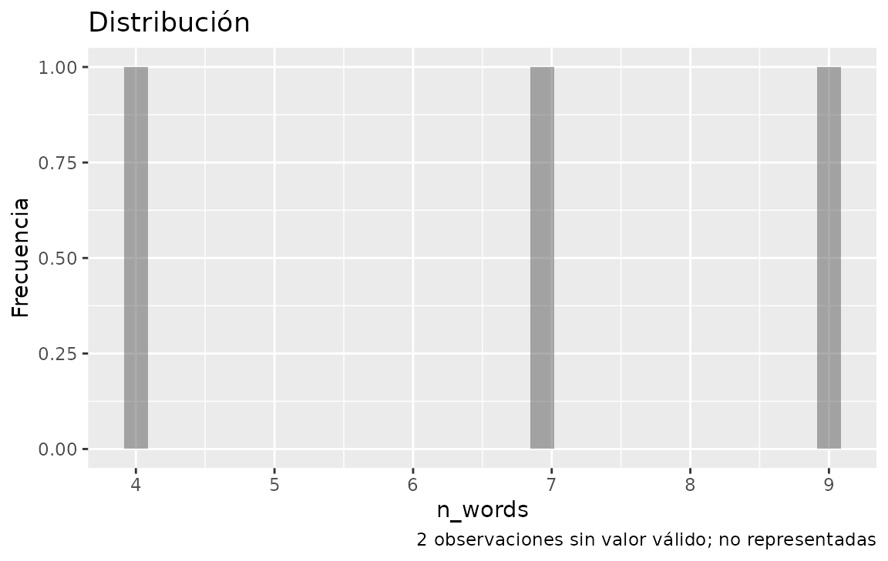
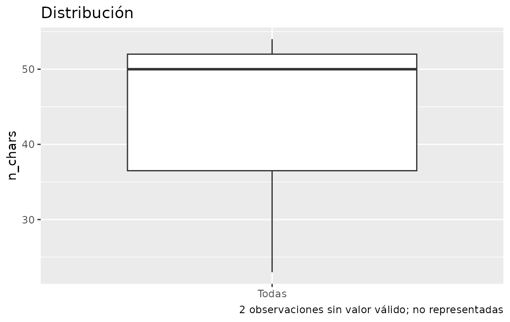
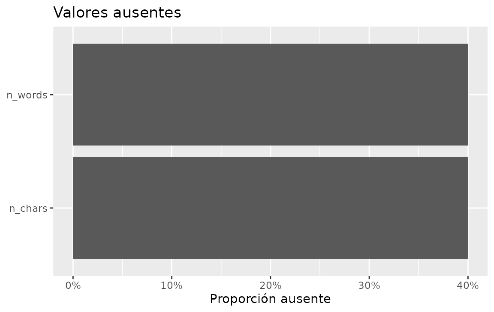

# Graficar resúmenes de EntropIA

*Versión en español.* English:
[`vignette("visualize.en")`](https://humalab.github.io/EntropIA-R/articles/visualize.en.md).

Los helpers de gráfico consumen **tibbles ya resumidos**. No consultan
SQLite. ggplot2 está en Suggests.

``` r

con <- entropia_connect(system.file(
  "extdata", "entropia-example.sqlite",
  package = "entropiaR"
))
eda <- entropia_overview(con)
```

## Colecciones y cobertura

``` r

entropia_plot_collections(eda$collections)
```



``` r

entropia_plot_coverage(eda$quality, metric = "ocr_coverage")
```



La cobertura usa `group` como etiqueta y `group_id` si existe: dos
colecciones llamadas “Archivo” siguen siendo dos barras. `no_data` /
`not_applicable` se anotan, no se dibujan como 0%.

## Entidades y temas

``` r

entropia_plot_entities(eda$entities)
```



``` r

entropia_plot_topics(eda$topics)
```



`top` deja las filas más frecuentes. `top_by = "group"` (solo entidades)
toma el top-N *dentro de cada grupo*.

## Series temporales

El temporal de overview usa la columna `date`:

``` r

entropia_plot_temporal(eda$temporal, date_var = "date")
```



Un perfil con `by` exige `group` si quedan varias columnas candidatas:

``` r

items <- entropia_collect(entropia_items(con))
by_title <- entropia_temporal_profile(items, created_at, unit = "day")
entropia_plot_temporal(by_title)
```



## Longitudes y faltantes

``` r

lengths <- entropia_document_lengths(entropia_collect(entropia_text(con)))
entropia_plot_distribution(lengths, n_words, type = "histogram")
```



``` r

entropia_plot_distribution(lengths, n_chars, type = "boxplot")
```



``` r


prof <- entropia_profile(lengths, columns = c("n_chars", "n_words"))
entropia_plot_missing(prof$missing)
```



Una entrada vacía dibuja “Sin datos…” en lugar de fallar.

## Extender y guardar

``` r

p <- entropia_plot_entities(eda$entities) +
  ggplot2::labs(caption = "Ocurrencias, no identidades resueltas")
tmp <- tempfile(fileext = ".png")
ggplot2::ggsave(tmp, p, width = 6, height = 4)
file.exists(tmp)
#> [1] TRUE
```

``` r

entropia_disconnect(con)
```

Siguiente:
[`vignette("dashboard")`](https://humalab.github.io/EntropIA-R/articles/dashboard.md).
English:
[`vignette("visualize.en")`](https://humalab.github.io/EntropIA-R/articles/visualize.en.md).
